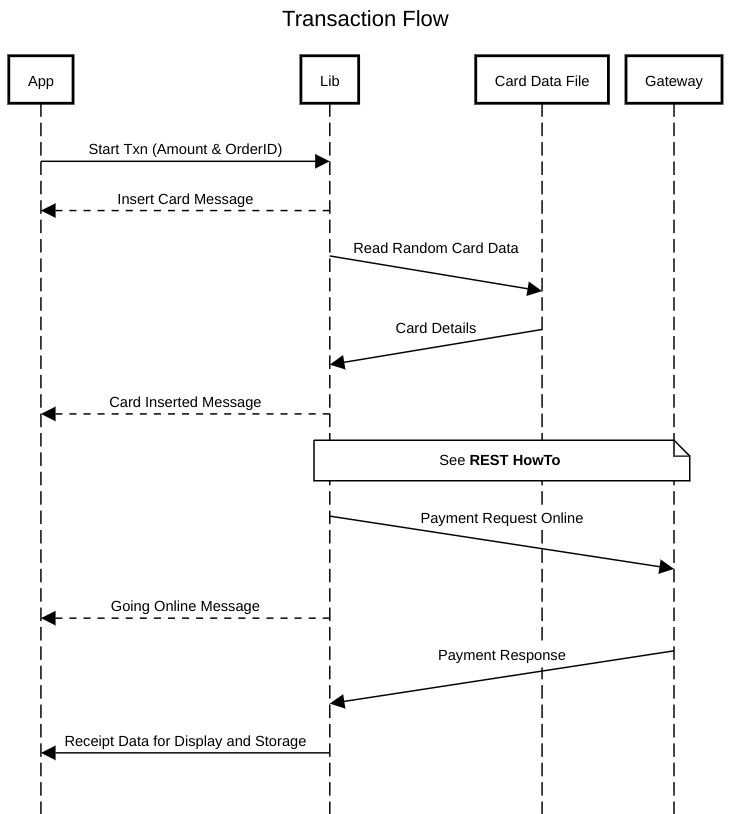

# The Project

You are tasked with creating a library and application that processes transactions on the PAYROC gateway. Given the supplied sequence diagram and card data file you will need to create a library that simulates a transaction. The application should handle all messaging and events from the library.

The app should have the following functionality:

1. The app should take an amount and order ID and pass it to the library. The library should use the supplied card data file to simulate the transaction.
- NOTES
  - The order ID can be a generated or input from the UI.
  - See the attached sequence diagram for how to implement the card simulator.
  - Delays may need to be added to properly simulate long running processes. (i.e. 10-15 seconds for a card read)
  - See the attached 'REST HowTo' for instructions on implementing the REST request.
  - Care must be taken to handle all errors correctly in the library and the application.
2. The app should display the transaction receipt from the gateway. The receipt should be stored and viewable later.
- NOTES
  - It is up to the implementer how to display the data.
  - UI design and implementation will be of interest for this task.

Project can be submitted via zip or via a github repo link. Any additional testing tools or documentation should be included.

# Simulator Diagram




# REST HowTo

The payment request will be processed via the Payroc payment gateway.

You will need to construct the request (including data, headers and url) based on the API documentation. The specific payment docs can be found here:
```
https://developers.worldnetpayments.com/apis/merchant/#tag/payments
```

The test URL endpoint can be found here:
```
https://testpayments.worldnettps.com/merchant/api/v1
```

The credentials for this project are:

```
terminal: 5140001 
api-key: 14c7974ba5b38d0dbcb7a0d8bdf3959e3b316a812ab3815db17878719f50c0ce8da30b7c1690ba5698ce2ae3a714047052b389b3d7401dbb457fcc7abdac3ffd
```

For the payments there are 2 fields to pass in via user input: `amount`, `orderId` (potentially generated)

For this project there are a number of fields that will be static:

```
channel: "POS"
currency: "USD"
device:type: "PAX_A920_PRO"
```

There are a number of fields that will need to be retrieved from the card data file:

`payloadType`, `dataKsn` and (depending on payloadType) either `encryptedData` or `tlv` (see note)

NOTES:
- The card data file has 2 types of transactions and the request will need to be populated depending on what card data is chosen randomly.
- The `MAG_STRIPE` data doesn't need any processing other than populating the correct fields.
- For an `EMV` (or CHIP) data set you will need to create a Tag Length Value (TLV) string. TLV strings are used frequently in card payments. Depending on language there are a number of libraries.

Here is an example card data entry with generated request and response to help illustrate:

CARD DATA:
```xml
<cards>
    <card>
        <dataKsn>F8765432110000000079</dataKsn>
        <payloadType>EMV</payloadType>
        <tags key="df79" value="353533"/>
        <tags key="5f28" value="0840"/>
        <tags key="9f6e" value="0840000030300000000000000000000000000000000000000000000000000000"/>
        <tags key="9f12" value="4d617374657263617264"/>
        <tags key="9f11" value="01"/>
        <tags key="50" value="4d415354455243415244"/>
        <tags key="5f24" value="251231"/>
        <tags key="5f25" value="210301"/>
        <tags key="8c" value="9f02069f03069f1a0295055f2a029a039c019f37049f35019f45029f4c089f34039f21039f7c14"/>
        <tags key="8d" value="910a8a0295059f37049f4c08"/>
        <tags key="8e" value="00000000000000005e031f03"/>
        <tags key="9f07" value="ff00"/>
        <tags key="9f0d" value="b450808000"/>
        <tags key="9f0e" value="0000000000"/>
        <tags key="9f0f" value="b470808000"/>
        <tags key="9f16" value="39343235383231373333"/>
        <tags key="9f1c" value="3132333435363738"/>
        <tags key="9f1e" value="3138353030313038"/>
        <tags key="9f42" value="0840"/>
        <tags key="9f4e" value="57616c6d6172744e6577596f726b"/>
        <tags key="df78" value="1850010868"/>
        <tags key="9f41" value="00000501"/>
        <tags key="9f10" value="0111a04009220400000000000000000000ff"/>
        <tags key="9f09" value="0002"/>
        <tags key="84" value="a0000000041010"/>
        <tags key="5f34" value="01"/>
        <tags key="5f2d" value="656e"/>
        <tags key="9f37" value="10a4e280"/>
        <tags key="9c" value="00"/>
        <tags key="9f21" value="152937"/>
        <tags key="9b" value="0000"/>
        <tags key="9a" value="220905"/>
        <tags key="5f2a" value="0840"/>
        <tags key="95" value="0000008001"/>
        <tags key="9f35" value="22"/>
        <tags key="9f1a" value="0840"/>
        <tags key="9f33" value="e00808"/>
        <tags key="9f39" value="07"/>
        <tags key="9f27" value="80"/>
        <tags key="9f34" value="1f0302"/>
        <tags key="9f36" value="013f"/>
        <tags key="82" value="1980"/>
        <tags key="9f06" value="a0000000041010"/>
        <tags key="4f" value="a0000000041010"/>
        <tags key="9f26" value="81bf9f3fef7dd0b7"/>
        <tags key="9f03" value="000000000000"/>
        <tags key="9f02" value="000000000500"/>
        <tags key="9f40" value="6000f0b001"/>
        <tags key="9f53" value="46"/>
        <tags key="c2" value="43d764d2c035c0cef759bab058e868bcac1a11f71278e611dfdf2d99f87538b5"/>
        <tags key="c0" value="f8765432110000000079"/>
        <tags key="5f20" value="4e6f7420417661696c61626c65"/>
        <tags key="df78" value="1850010868"/>
    </card>
</cards>
```

REQUEST:
```json
{
    "channel": "POS",
    "terminal": "5140001",
    "order": {
        "orderId": "QM1UKY",
        "currency": "USD",
        "totalAmount": 5.0,
    },
    "customerAccount": {
        "device": {
            "type": "PAX_A920_PRO",
            "dataKsn": "F8765432110000000079",
        },
        "tlv": "DF79033535335F280208409F6E2008400000303000000000000000000000000000000000000000000000000000009F120A4D6173746572636172649F110101500A4D4153544552434152445F24032512315F25032103018C279F02069F03069F1A0295055F2A029A039C019F37049F35019F45029F4C089F34039F21039F7C148D0C910A8A0295059F37049F4C088E0C00000000000000005E031F039F0702FF009F0D05B4508080009F0E0500000000009F0F05B4708080009F160A393432353832313733339F1C0831323334353637389F1E0831383530303130389F420208409F4E0E57616C6D6172744E6577596F726BDF780518500108689F4104000005019F10120111A04009220400000000000000000000FF9F090200028407A00000000410105F3401015F2D02656E9F370410A4E2809C01009F21031529379B0200009A032209055F2A020840950500000080019F3501229F1A0208409F3303E008089F3901079F2701809F34031F03029F3602013F820219809F0607A00000000410104F07A00000000410109F260881BF9F3FEF7DD0B79F03060000000000009F02060000000005009F40056000F0B0019F530146C22043D764D2C035C0CEF759BAB058E868BCAC1A11F71278E611DFDF2D99F87538B5C00AF87654321100000000795F200D4E6F7420417661696C61626C65DF78051850010868",
        "payloadType": "EMV"
    }
}
```

RESPONSE:
```json
{
    "uniqueReference": "EQZB2G8K1V",
    "terminal": "136007",
    "order": {
        "orderId": "QM1UKY",
        "currency": "USD",
        "totalAmount": 5.00,
        "orderBreakdown": {
            "subtotalAmount": 5.00
        }
    },
    "customerAccount": {
        "cardType": "MasterCard",
        "cardholderName": "Not Available",
        "maskedPan": "541333******4111",
        "expiryDate": "1225",
        "entryMethod": "CONTACTLESS ICC"
    },
    "securityCheck": {
        "cvvResult": "M",
        "avsResult": "Y"
    },
    "transactionResult": {
        "type": "SALE",
        "status": "READY",
        "approvalCode": "OK586",
        "dateTime": "2022-09-05T11:08:59.417-04:00",
        "currency": "USD",
        "authorizedAmount": 5.00,
        "resultCode": "A",
        "resultMessage": "OK586",
        "storedPaymentCredentials": {
            "terminal": "136007",
            "merchantReference": "MREF_5f88ae93-c923-4e6c-adbd-acfff9801fb9B6",
            "cardholderName": "Test Card 07 Uat Usa",
            "credentialsNumber": "2967536247202906",
            "maskedPan": "541333******4111",
            "securityCheck": "CVV_VALIDATED"
        }
    },
    "additionalDataFields": [
        {
            "name": "ORDER_NUM",
            "value": "09139515"
        }
    ],
    "emvTags": [
        {
            "hex": "91",
            "value": "26a6e3d08861c4e23030"
        },
        {
            "hex": "84",
            "value": "a0000000041010"
        },
        {
            "hex": "8A",
            "value": "3030"
        }
    ]
}
```
